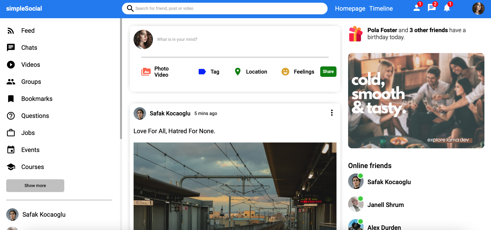
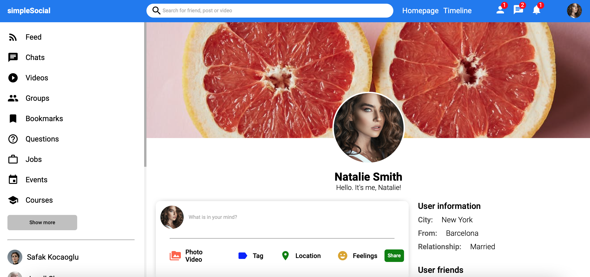
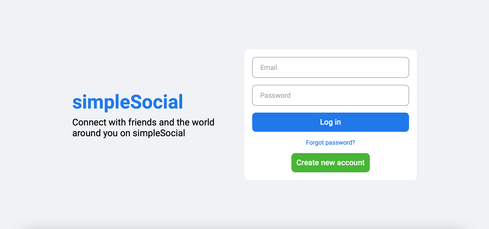
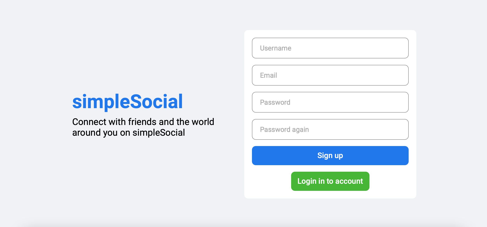

# Getting Started with creating React apps

Another react app from lamaDev tutorial on youtube. I learned a lot from this tutorial. Especially the use of css flex.

This project is similar to facebook website. It is some kind of social website. 

This project is from [youtube tutorial](https://www.youtube.com/watch?v=zM93yZ_8SvE).

## Check out the Lama Dev youtube channel

You can learn more from him [here](https://www.youtube.com/channel/UCOxWrX5MIdXIeRNaXC3sqIg).

# Website screenshots

## Home page

## Profile page

## Login page

## Register page
